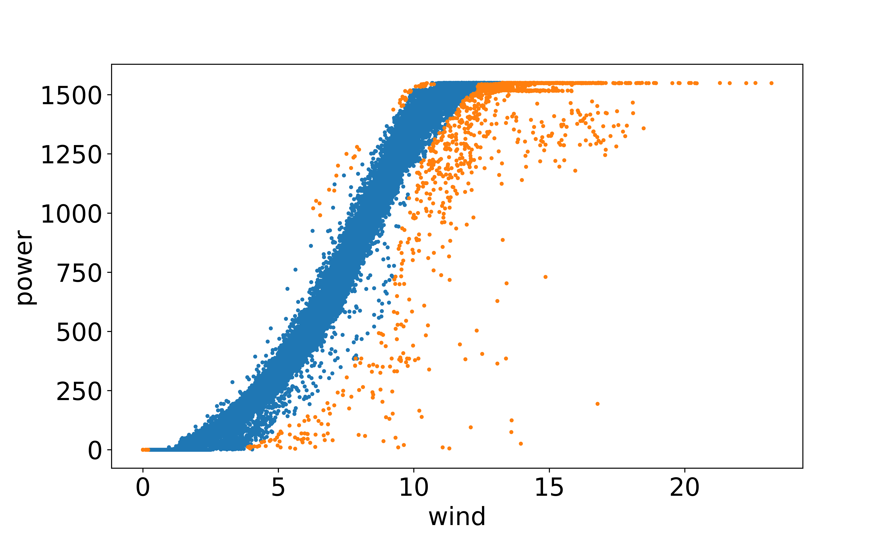
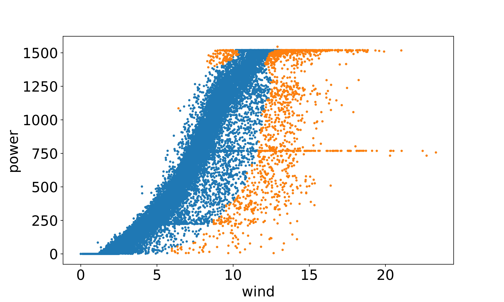
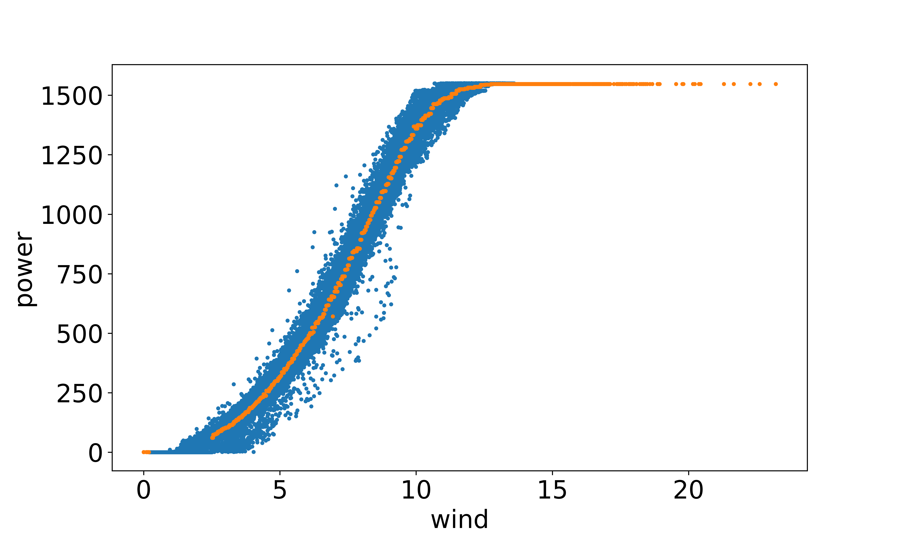
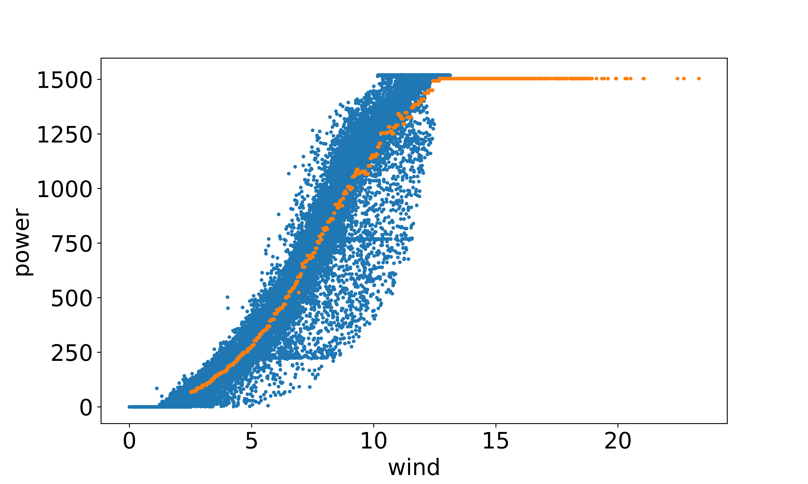
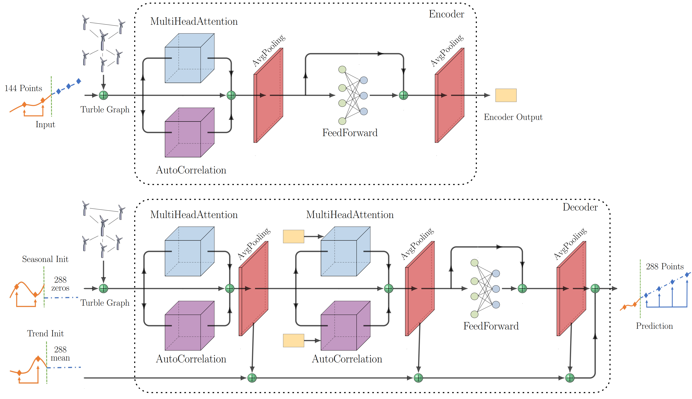
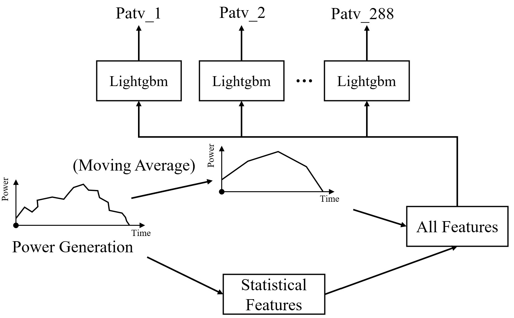

# Team zhangshijin Baidu KDD CUP 2022 Spatial Dynamic Wind Power Forecasting Challenge Technical Report
## 1.Introduction
The use of wind power, a pollution-free and renewable form of
energy, to generate electricity has attracted increasing attention in
recent years. However, intermittent electricity generation resulting
from the stochastic nature of wind speed poses challenges to the
safety and stability of electric power grids. For the efficient use of
wind energy, Wind Power Forecasting (WPF) has been widely recognized as one of the most critical issues in wind power integration,
and it aims to accurately estimate the wind power supply of wind
farms at different time scales.


## 2.Download Data
 download link: [Tsinghua Cloud](https://cloud.tsinghua.edu.cn/d/8fe76ca7d1474ee7931b/)

all_data_water.csv -> /data/all_data_water.csv

wtbdata_245days.csv -> /data/wtbdata_245days.csv

wtbdata_245days.csv -> /P2Ptree/raw_data/wtbdata_245days.csv

data_del5_SingleLgbRepair -> /P2Ptree/data_del5_SingleLgbRepair


## 3.Model Training and Testing

```
for train Deep models:
    python /home/user/david/kdd/Data_Competitions/KDD2022_WPF/main.py --conf ./config/config_clear_st_18.yaml

for train P2Ptree:
    cd ./P2Ptree/code/
    python train_parallel.py

for test:
    python kddcup22-sdwpf-evaluation/paddlepaddle/evaluation.py
```
The trained model will be saved in `output_path` directory.

## 4.Requirements

```
optuna>=2.10.1
lightgb>=3.1.1
pgl==2.2.3post0
paddlepaddle-gpu>=2.3.0.post112
```
## 5.Data Engineering Based on Wind Power Curves

We first analyze the anomaly of the dataset, such as missing data, unknown data, and other singularities, by performing anomaly detection according to the wind power
curve. And then perform the data processing to deal with these anomalies.

Anomaly detection:




Distribution correction：



    
## 6.Model Architecture

Inspired by the innovations from Autoformer and FEDformer, our model uses an encoder-decoder structure that includes sequence decomposition using average pooling, auto-correlation
mechanism for sequence-level connections, multi-head attention from original transformer, graph neural network encoding and feedforward module, as shown below. 



## 7.Point-by-point prediction based on tree model (P2Ptree)

Besides building a deep learning model with PaddlePaddle to predict future wind power generation, we also build the LightGBM model to reduce prediction variance and increase generability by
ensembling different models.
Thus, we reduce the number of models in the following two ways: clustering of wind turbines and downsampled power generation at time scale.



## 8.Results
The steady improvement of online experiments proves the effectiveness of our modeling techniques, including data cleaning, feature screening, model design, and fusion strategies.

 Results of Phase 2:

| Serial No. | Model Components                                | Online Score       | Offline Score |
|------------|-------------------------------------------------|--------------------|---------------|
| 1          | baseline                                        | -                  | -46.83        |
| 2          | phase 2 basic                                   | -44.72740          | -43.78076     |
| 3          | + feature screening1                            | -44.60840          | -43.59530     |
| 4          | + model fusion                                  | -44.58287          | -43.63643     |
| 5          | + feature screening2 + data cleaning            | -44.46343          | -43.36928     |
| 6          | + Change the training parameters                | -44.40641          | - 43.26067    |
| 7          | + feature screening3                            | -44.39223          | -43.28473     |
| 8          | + model fusion + Change the training parameters | -44.37068          | -43.31144     |
| 9          | + P2Ptree                                       | **-44.32841**      | -43.28473     |

 Results of Phase 3:

 | Serial No. | Model Components                    | Online Score       | Offline Score |
|------------|-------------------------------------|--------------------|---------------|
| 1          | phase 3 basic                       | -45.48641          | -43.33292     |
| 2          | + data cleaning                     | -45.28938          | -43.31111     |
| 3          | + feature screening                 | -45.25772          | -43.40196     |
| 4          | + autocorrelation mechanism         | -45.20941          | -43.10517     |
| 5          | + model fusion                      | **-45.13867**      | -43.10917     |
| 6          | Add the P2Ptree based on model No.2 | -45.22724          | 43.35802      |

## 9.Contact
If you have any questions, please contact liangxf20@mails.tsinghua.edu.cn.